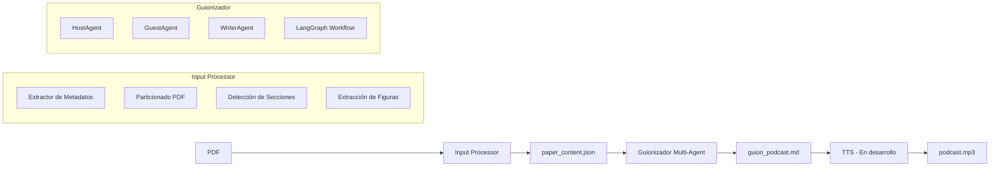

# CenzontLLM 

**Framework open-source para generar podcasts científicos en español a partir de papers (PDF → voces realistas)**

> *"Cenzontli" = 400 en náhuatl → 400 voces para la ciencia.


---

## ¿Qué hace?

Convierte **cualquier artículo científico (PDF)** en un **podcast conversacional profesional** con:

- 1–3 hosts/guests con personalidades únicas
- Diálogos naturales, fieles al paper
- Voces realistas en español (neutro + acentos regionales)
- Música, efectos y normalización profesional
- **100% automático, cloud low-cost (esperado: <$1/episodio)**

---

## 🚀 Inicio Rápido (local, pero sugiero usar Docker)

### Requisitos Previos

- **Python**: 3.10, 3.11 o 3.12
- **Poetry**: Para gestión de dependencias ([instalación](https://python-poetry.org/docs/#installation))
- **Sistema operativo**: Linux, macOS o WSL2 (Windows)
- **Opcional**: Docker + NVIDIA GPU (para procesamiento de imágenes)

### Instalación

1. **Clonar el repositorio:**
   ```bash
   git clone https://github.com/IsaacNietoG/cenzontllm.git
   cd cenzontllm
   ```

2. **Instalar dependencias con Poetry:**
   ```bash
   poetry install
   ```

3. **Activar el entorno virtual:**
   ```bash
   poetry shell
   ```

4. **Configurar variables de entorno:**
   
   Crea un archivo `.env` en la raíz del proyecto:
   ```bash
   cp .env.example .env  # Si existe, o crea uno nuevo
   ```
   
   Edita `.env` y agrega tu API key de Groq (opcional para modo mock):
   ```env
   CENZONT_GROQ_API_KEY=tu_api_key_aqui
   CENZONT_RUN_MODE=mock  # o "groq" para usar LLM real
   CENZONT_MODEL=llama-3.3-70b-versatile
   CENZONT_NUM_GUESTS=1
   CENZONT_TARGET_MINUTES=20
   ```

### Uso Básico

#### 1. Procesar un PDF científico

Extrae el contenido del PDF y genera un archivo JSON estructurado:

```bash
python -m src.cenzontllm.main input ruta/al/paper.pdf
```

Esto genera `paper_content.json` con:
- Metadatos (título, autores, DOI, año)
- Secciones detectadas (Abstract, Introduction, Methods, Results, etc.)
- Figuras extraídas (con captions placeholder)

#### 2. Generar el guion del podcast

Desde el JSON generado, crea un guion conversacional:

**Modo Mock (rápido, sin API):**
```bash
python -m src.cenzontllm.main guion paper_content.json --mock
```

**Modo Groq (requiere API key):**
```bash
python -m src.cenzontllm.main guion paper_content.json --no-mock
```

El guion se guarda en `guion_podcast.md` con formato Markdown.

#### 3. Pipeline completo (en desarrollo)

```bash
python -m src.cenzontllm.main run paper.pdf --output podcast.mp3
```

> ⚠️ **Nota**: El comando `run` aún no está implementado. Por ahora, usa los pasos 1 y 2 por separado.

---

## 📋 Ejemplo Completo

Ejemplo funcional incluido en el repositorio:

```bash
# 1. Procesar el PDF de ejemplo
python -m src.cenzontllm.main input examples/attentionIsAllYouNeed/attentionIsAllYouNeed.pdf

# 2. Generar el guion
python -m src.cenzontllm.main guion examples/attentionIsAllYouNeed/paper_content.json --mock

# 3. Ver el resultado
cat guion_podcast.md
```

El ejemplo usa el paper "Attention Is All You Need" (Vaswani et al., 2017) y genera un guion de podcast con Ana (host) y un experto invitado.

---

## 🏗️ Arquitectura

> 📖 **Documentación completa**: Ver [ARCHITECTURE.md](ARCHITECTURE.md) para detalles técnicos detallados.



### Componentes Principales

1. **Input Processor** (`src/cenzontllm/input_processor/`)
   - Extrae metadatos del PDF (título, autores, DOI)
   - Particiona el documento usando `unstructured`
   - Detecta secciones automáticamente (Abstract, Introduction, Methods, Results, Discussion, Conclusion)
   - Extrae figuras (captioning con GPU pendiente)

2. **Guionizador** (`src/cenzontllm/guionizador/`)
   - **HostAgent**: Genera personalidades de invitados y outline del podcast
   - **GuestAgent**: Responde preguntas como experto con personalidad única
   - **WriterAgent**: Convierte la conversación en guion profesional con formato Markdown
   - **Workflow LangGraph**: Orquesta la conversación iterativa entre agentes

3. **CLI** (`src/cenzontllm/main.py`)
   - Interfaz de línea de comandos con Typer
   - Comandos: `input`, `guion`, `run` (en desarrollo)

Para más detalles sobre el diseño, flujo de datos, decisiones técnicas y extensiones futuras, consulta [ARCHITECTURE.md](ARCHITECTURE.md).

---

## 📊 Estado Actual del Proyecto

| Componente | Estado | Descripción |
|------------|--------|-------------|
| **Input Processor** | ✅ **Funcional** | Extrae metadatos, particiona PDF, detecta secciones. Funciona con PDFs en español e inglés. |
| **Guionizador** | ✅ **Funcional** | Sistema multi-agente completo. Genera guiones en modo mock y con Groq API. |
| **Modo Mock** | ✅ **Completo** | Permite probar el sistema sin API keys. Respuestas predefinidas para desarrollo. |
| **Integración Groq** | ✅ **Completo** | Soporte para Llama 3.3 70B a través de Groq API. |
| **CLI** | ✅ **Funcional** | Comandos `input` y `guion` operativos. |
| **Docker** | ✅ **Listo** | Dockerfile con CUDA para procesamiento GPU. |
| **TTS (Text-to-Speech)** | 🚧 **Pendiente** | Conversión de guion a audio. |
| **Pipeline Completo** | 🚧 **Pendiente** | Comando `run` que integre todo el flujo. |
| **Captioning de Figuras** | 🚧 **Pendiente** | Descripción automática de figuras con modelos de visión. |
| **Integración Ollama** | 🚧 **Pendiente** | Soporte para modelos locales. |

### Funcionalidades Implementadas

✅ Extracción completa de contenido de PDFs científicos  
✅ Detección automática de secciones (Abstract, Introduction, Methods, Results, Discussion, Conclusion)  
✅ Generación de personalidades de invitados con acentos regionales  
✅ Creación de outline estructurado para el podcast  
✅ Conversación multi-agente con evaluación iterativa  
✅ Generación de guiones en formato Markdown con anotaciones de voz  
✅ Modo mock para desarrollo sin costos de API  
✅ Integración con Groq API para LLMs de producción  

### Próximos Pasos

- [ ] Implementar TTS (Text-to-Speech) con voces en español
- [ ] Completar pipeline end-to-end (`run` command)
- [ ] Captioning de figuras con modelos de visión (LLaVA, GPT-4V)
- [ ] Integración con Ollama para modelos locales
- [ ] Post-procesamiento de audio (música, efectos, normalización)
- [ ] Tests unitarios y de integración
- [ ] Documentación de API

---

## ⚙️ Configuración

### Variables de Entorno

Crea un archivo `.env` en la raíz del proyecto:

```env
# Modo de ejecución: "mock" (sin API) o "groq" (con Groq API)
CENZONT_RUN_MODE=mock

# API Key de Groq (requerido si RUN_MODE=groq)
# Obtén tu key en: https://console.groq.com/
CENZONT_GROQ_API_KEY=

# Modelo a usar (Groq u Ollama)
CENZONT_MODEL=llama-3.3-70b-versatile

# Número de invitados en el podcast (1-3)
CENZONT_NUM_GUESTS=1

# Rondas máximas de conversación
CENZONT_MAX_REPLICA_ROUNDS=2

# Duración objetivo del podcast (minutos)
CENZONT_TARGET_MINUTES=20
```

### Configuración Avanzada

Las configuraciones se pueden modificar en `src/cenzontllm/guionizador/config.py` o mediante variables de entorno con prefijo `CENZONT_`.

---

## 🐳 Uso con Docker

### Construir la imagen

```bash
docker build -t cenzontllm .
```

### Ejecutar

```bash
# Procesar PDF
docker run --rm -v "$(pwd)":/app cenzontllm input examples/attentionIsAllYouNeed.pdf
# Generar guion
docker run --rm -v "$(pwd)":/app --env-file .env cenzontllm guion examples/attentionIsAllYouNeed/paper_content.json
```


---

## 🛠️ Desarrollo

### Estructura del Proyecto

```
CenzontLLM/
├── src/
│   └── cenzontllm/
│       ├── input_processor/    # Procesamiento de PDFs
│       │   ├── extractor.py    # Particionado con unstructured
│       │   ├── metadata.py     # Extracción de metadatos
│       │   ├── section_detector.py  # Detección de secciones
│       │   ├── figure_captioner.py  # Captioning de figuras (WIP)
│       │   └── pipeline.py     # Pipeline principal
│       ├── guionizador/        # Sistema multi-agente
│       │   ├── agents/
│       │   │   ├── base.py     # Clase base para agentes
│       │   │   ├── host.py     # HostAgent
│       │   │   ├── guest.py    # GuestAgent
│       │   │   └── writer.py   # WriterAgent
│       │   ├── graph.py        # Workflow LangGraph
│       │   ├── prompts.py      # Prompts para LLMs
│       │   ├── config.py       # Configuración
│       │   └── mocks.py        # Respuestas mock
│       └── main.py             # CLI principal
├── examples/                   # Ejemplos de uso
├── Dockerfile                  # Imagen Docker
├── pyproject.toml             # Dependencias Poetry
└── README.md                  # Este archivo
```

### Modo Mock vs. Modo Groq

**Modo Mock** (`--mock`):
- No requiere API keys
- Respuestas predefinidas para desarrollo
- Útil para probar la estructura del workflow
- Rápido y sin costos

**Modo Groq** (`--no-mock`):
- Usa Groq API con Llama 3.3 70B
- Genera contenido real basado en el paper
- Requiere `CENZONT_GROQ_API_KEY`
- Costos según uso de la API

---

## 🐛 Troubleshooting

### Error: "No module named 'unstructured'"

**Solución**: Instala las dependencias con Poetry:
```bash
poetry install
```

### Error: "GROQ_API_KEY not found"

**Solución**: 
- Si usas modo mock: no necesitas la key, usa `--mock`
- Si usas modo Groq: crea `.env` con `CENZONT_GROQ_API_KEY=tu_key`

### Error al procesar PDF: "Tesseract not found"

**Solución**: Instala Tesseract OCR:
```bash
# Ubuntu/Debian
sudo apt-get install tesseract-ocr

# macOS
brew install tesseract

# Windows (WSL)
sudo apt-get install tesseract-ocr
```

### El guion generado está vacío o incompleto

**Posibles causas**:
- El PDF no tiene texto extraíble (es una imagen escaneada)
- El modo mock está limitado, prueba con `--no-mock`
- El paper es muy corto o no tiene secciones claras

**Solución**: Verifica que `paper_content.json` tenga contenido válido antes de generar el guion.

---

## 📚 Dependencias Principales

- **LangGraph**: Orquestación de workflows multi-agente
- **LangChain Core**: Integración con LLMs
- **Unstructured**: Procesamiento avanzado de PDFs
- **PyMuPDF**: Lectura de PDFs
- **Groq**: API para LLMs rápidos
- **Typer**: CLI moderna
- **Pydantic**: Validación de datos y configuración

Ver `pyproject.toml` para la lista completa.

---

## 📄 Licencia

[Apache 2.0](LICENSE)

---

## 🤝 Contribuciones

Las contribuciones son bienvenidas. Por favor:
1. Fork el repositorio
2. Crea una rama para tu feature (`git checkout -b feature/AmazingFeature`)
3. Commit tus cambios (`git commit -m 'Add some AmazingFeature'`)
4. Push a la rama (`git push origin feature/AmazingFeature`)
5. Abre un Pull Request


> Hecho con ❤️ y LLMs open-source.  

