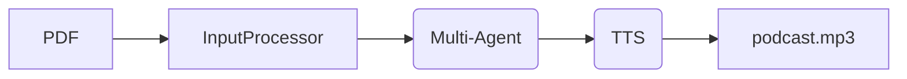

# CenzontLLM 

**Framework open-source para generar podcasts científicos en español a partir de papers (PDF → voces realistas)**

> *"Cenzontli" = 400 en náhuatl → 400 voces para la ciencia.

---

## ¿Qué hace?

Convierte **cualquier artículo científico (PDF)** en un **podcast conversacional profesional** con:

- 1–3 hosts/guests con personalidades únicas
- Diálogos naturales, fieles al paper
- Voces realistas en español (neutro + acentos regionales)
- Música, efectos y normalización profesional
- **100% automático, cloud low-cost (esperado: <$1/episodio)**

---

## Arquitectura (MVP)

---

## Estado actual

| Componente       | Estado         |
|------------------|----------------|
| Input Processor  | In progress    |
| Guionizador      | In progress    |
| Voces (TTS)      | In progress    |
| Docker + Cloud   | Ready          |

---

## Roadmap

- **Dic 2025**: MVP (PDF → 2 voces → 20 min)

---

## Especificación técnica

Ver [`SPEC.org`](SPEC.org) (en progreso).

---

## Licencia

[Apache 2.0](LICENSE)

---

> Hecho con ❤️ y LLMs open-source.  

